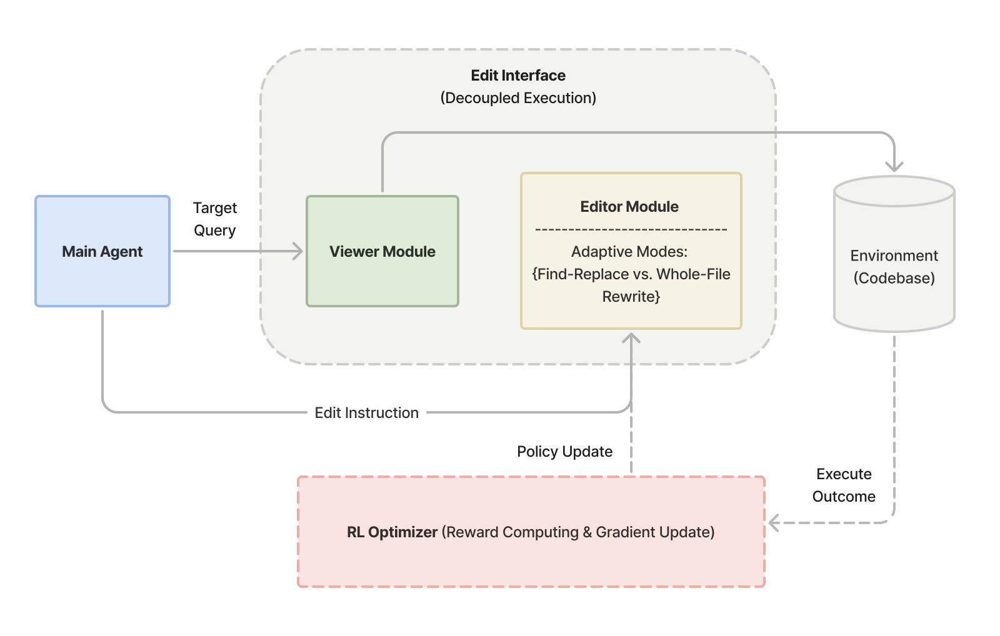

<div align="center">

# SWE-Edit

**Rethinking Code Editing for Efficient Software Engineering Agents**

[](https://arxiv.org/abs/TODO)
[](https://opensource.org/licenses/Apache-2.0)
[](https://www.python.org/downloads/)

</div>

---

This is the official GitHub repository for the paper **"SWE-Edit: Rethinking Code Editing for Efficient SWE-Agent"**.

## Overview

**SWE-Edit** is a dual-optimization framework that improves both the performance and efficiency of code editing in LLM-based software engineering agents.

### Method

SWE-Edit addresses the context coupling problem in traditional code editing interfaces through:

1. **Scaffolding-Level Optimization**: Decomposing the code editing interface into specialized subagents
   - **Viewer Subagent**: Extracts task-relevant code snippets on demand, eliminating context pollution
   - **Editor Subagent**: Executes modifications from natural language instructions, decoupling reasoning from format-sensitive generation

2. **Model-Level Optimization**: Training an adaptive editor with GRPO that learns to select between editing modes (find-replace vs. whole-file rewrite) based on task characteristics

<p align="center">
  
  <br>
  <em>Figure 1: Overview of the SWE-Edit framework showing the dual optimization mechanism with Viewer and Editor subagents.</em>
</p>

### Results on SWE-bench Verified

**Table 1**: Main results comparing baseline vs. SWE-Edit on SWE-bench Verified (500 instances, 3 runs).

| Configuration | Resolved (%) | Cost ($) | Edit Success (%) |
|---------------|--------------|----------|------------------|
| Baseline      | 69.9         | 243.7    | 93.4             |
| SWE-Edit      | **72.0 (+2.1)** | **200.1 (-17.9%)** | **96.9 (+3.5)** |

SWE-Edit achieves both higher performance and lower cost, breaking the typical accuracy-cost trade-off.

## Installation

We use [uv](https://docs.astral.sh/uv/) for Python environment management.

```bash
git clone https://github.com/microsoft/SWE-Edit.git
cd SWE-Edit
uv sync
```

For SWE-bench evaluation:
```bash
uv sync --group eval
```

## Configuration

### Main Agent Configuration

Create a `.env` file in the project root:

**OpenAI:**
```bash
API_TYPE="OPENAI"
OPENAI_API_KEY=<your-api-key>
MODEL=gpt-4o
```

**Anthropic:**
```bash
API_TYPE="ANTHROPIC"
ANTHROPIC_API_KEY=<your-api-key>
MODEL=claude-3-5-sonnet-20241022
```

**Azure OpenAI:**
```bash
API_TYPE="AZURE_OPENAI"
AZURE_API_KEY=<your-api-key>
AZURE_ENDPOINT=<your-endpoint>
DEPLOYMENT=<deployment-name>
```

### Editor/Viewer Subagent Configuration

The editor and viewer subagents can use different (typically smaller and cheaper) models. Configure them in one of two ways:

**Option 1: Environment variables** (recommended for simple setups)

Add to your `.env` file with the `LLM_EDITOR_` prefix:
```bash
# Main agent uses GPT-4
API_TYPE="OPENAI"
OPENAI_API_KEY=<your-api-key>
MODEL=gpt-4o

# Editor/Viewer use GPT-4o-mini for cost efficiency
LLM_EDITOR_API_TYPE="OPENAI"
LLM_EDITOR_OPENAI_API_KEY=<your-api-key>
LLM_EDITOR_MODEL=gpt-4o-mini
```

**Option 2: JSON configuration files**

Create JSON files under `./api_configs/` directory. For example, `api_configs/gpt-5-mini.json`:
```json
{
  "api_type": "OPENAI",
  "api_key": "your-api-key",
  "model": "gpt-4o-mini"
}
```

Then specify the model type during evaluation (see [SWE-bench Evaluation](#swe-bench-evaluation) section).

### Multi-API Load Balancing

For large-scale evaluation, you can provide multiple API keys by appending `_N` to environment variables:

```bash
API_TYPE_1="OPENAI"
OPENAI_API_KEY_1=<key-1>
MODEL_1=gpt-4o

API_TYPE_2="ANTHROPIC"
ANTHROPIC_API_KEY_2=<key-2>
MODEL_2=claude-3-5-sonnet-20241022
```

The agent will randomly select a configuration to distribute rate limits.

## Quick Start

Run the agent on a task:

```bash
uv run -m sweedit.main "Fix the bug in src/utils.py where the function returns None instead of an empty list"
```

The agent will use the Viewer to extract relevant code and the Editor to apply modifications. Trajectories are saved to `.traj/` for analysis.

## SWE-bench Evaluation

We provide complete evaluation scripts for SWE-bench Verified.

First, build the package:
```bash
uv build
```

Then run evaluation (see [evaluation/swebench-verified/README.md](evaluation/swebench-verified/README.md) for details):
```bash
uv run python evaluation/swebench-verified/main.py \
  --local_traj_path <path-to-trajectories> \
  --run_name <experiment-name> \
  --agent_type llm-editor \
  --llm_editor_model gpt-5-mini \
  --max_workers <num-workers>
```

The `--llm_editor_model` flag specifies which model to use for the editor/viewer subagents (uses `LLM_EDITOR_` prefixed env vars or JSON config files in `./api_configs/`).

## Repository Structure

```
.
├── src/sweedit/              # Core framework
│   ├── core/                 # Agent scaffolding
│   │   ├── agent.py          # Base agent
│   │   ├── agenthub/         # Agent implementations
│   │   └── llm.py            # LLM interface
│   └── tools/                # Agent tools
│       ├── llm_editor.py           # LLM-backed editing tool
│       ├── llm_file_editor.py      # Editor subagent
│       ├── execute_bash.py         # Shell execution
│       └── ...
└── evaluation/
    └── swebench-verified/    # SWE-bench evaluation scripts
```

## Citation

If you use SWE-Edit in your research, please cite:

```bibtex
@article{zhang2026sweedit,
  title={SWE-Edit: Rethinking Code Editing for Efficient SWE-Agent},
  author={Zhang, Yikai and Pei, Jiaxin and Li, Kenan and Wang, Maoquan and Pan, Jin and Kang, Yu and Fu, Shengyu and Nallipogu, Elsie and Hu, Junjie and Huang, Yufan and Jin, Zijian},
  journal={arXiv preprint},
  year={2026}
}
```

## License

This project is licensed under the MIT License - see the [LICENSE](LICENSE) file for details.

## Contributing

We welcome contributions! Please see [CONTRIBUTING.md](CONTRIBUTING.md) for guidelines.

---

<div align="center">

*Developed at Microsoft with University of Wisconsin–Madison*

</div>

## Trademarks

This project may contain trademarks or logos for projects, products, or services. Authorized use of Microsoft trademarks or logos is subject to and must follow Microsoft’s Trademark & Brand Guidelines. Use of Microsoft trademarks or logos in modified versions of this project must not cause confusion or imply Microsoft sponsorship. Any use of third-party trademarks or logos are subject to those third-party’s policies.